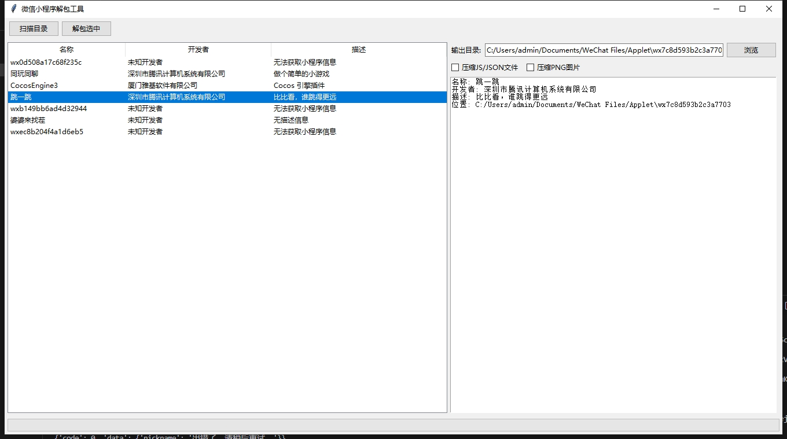

# wxapkg-gui

> **免责声明**：此工具仅限于学习和研究软件内含的设计思想和原理，用户承担因使用此工具而导致的所有法律和相关责任！作者不承担任何法律责任！

基于 [wux1an/wxapkg](https://github.com/wux1an/wxapkg) 项目开发的图形化界面工具，使用Python + tkinter实现。

## 📝 功能特性

- [x] 图形化界面操作，简单易用
- [x] 自动扫描微信小程序目录
- [x] 获取小程序信息（需要网络连接）
- [x] 支持批量解包wxapkg文件
- [x] 自动识别小游戏配置并重命名
- [x] 支持自定义输出目录
- [x] 实时显示解包进度
- [x] 支持Windows/macOS

## 🎨 使用说明

1. 用PC版微信打开小程序，让微信下载小程序文件
2. 运行本工具，点击"扫描目录"按钮选择微信小程序目录（默认为`~/Documents/WeChat Files/Applet`）
3. 在列表中选择要解包的小程序
4. 确认或修改输出目录（默认为小程序目录下的unpack子目录）
5. 点击"解包选中"按钮开始解包
6. 解包完成后可以选择直接打开输出目录查看结果

## ⚙️ 开发环境

- Python 3.8+
- tkinter
- pycryptodome
- requests

## 🛠️ 安装依赖

```bash
pip install -r requirements.txt
```

或者

```bash
pip install pycryptodome requests
```


## 🔨 开发者

- [cursor](https://github.com/cursor)

## 🤖 开发支持

本项目由以下AI模型提供开发支持：

- Claude (Anthropic)
- Deepseek

## 📷软件截图



## 🔗 参考项目

- [wux1an/wxapkg](https://github.com/wux1an/wxapkg) - 原始的命令行工具版本

- [BlackTrace/pc_wxapkg_decrypt](https://github.com/BlackTrace/pc_wxapkg_decrypt) - 小程序解密参考
- [Integ/wxapkg](https://gist.github.com/Integ/bcac5c21de5ea35b63b3db2c725f07ad) - 小程序解包参考

## 📄 许可证

MIT License